# Fully Automated Deployment of an Open Source Mail Server on AWS

## About 
This sample corresponds to the AWS Blog Post [*Fully Automated Deployment of an Open Source Mail Server on AWS*](https://aws.amazon.com/blogs/opensource/fully-automated-deployment-of-an-open-source-mail-server-on-aws/).

The sample integrates [Mail-in-a-Box](https://mailinabox.email/) with aWS infrastructure automations and services to fully automate the deployment of an open source mail server on AWS. This results in a fully automated setup of a single instance mail server, striving for minimal complexity and cost, while still providing high resiliency by leveraging incremental backups and automations. As such, the solution is best suited for small to medium organizations that are looking to run open source mail servers but do not want to deal with the associated operational complexity.

The sample uses an [AWS CloudFormation](https://aws.amazon.com/cloudformation/) [template](template.yaml) to automatically setup and configure an [Amazon Elastic Compute Cloud (Amazon EC2)](https://aws.amazon.com/ec2/) instance running Mail-in-a-Box, which integrates features such as email , webmail, calendar, contact, and file sharing, thus providing functionality similar to popular SaaS tools or commercial solutions. All resources to reproduce the solution are provided in this repository under an open source license (MIT-0).

[Amazon Simple Storage Service (Amazon S3)](https://aws.amazon.com/s3/) is used both for offloading user data and for storing incremental application-level backups. Aside from high resiliency, this backup strategy gives way to an immutable infrastructure approach, where new deployments can be rolled out to implement updates and recover from failures which drastically simplifies operation and enhances security.

We also provide an optional integration with [Amazon Simple Email Service (Amazon SES)](https://aws.amazon.com/ses/) so customers can relay their emails through reputable AWS servers and have their outgoing email accepted by third-party servers. All of this enables customers to deploy a fully featured open source mail server within minutes from [AWS Management Console](https://aws.amazon.com/console/), or restore an existing server from an Amazon S3 backup for immutable upgrades, migration, or recovery purposes.

## Table of contents
* [Fully Automated Deployment of an Open Source Mail Server on AWS](#fully-automated-deployment-of-an-open-source-mail-server-on-aws)
   * [About](#about)
   * [Table of contents](#table-of-contents)
   * [Overview of solution](#overview-of-solution)
   * [Deploying the solution](#deploying-the-solution)
      * [Prerequisites](#prerequisites)
      * [Preliminary steps: Setting up DNS and creating S3 Buckets](#preliminary-steps-setting-up-dns-and-creating-s3-buckets)
      * [Deploying and configuring Mail-in-a-Box](#deploying-and-configuring-mail-in-a-box)
   * [Testing the solution](#testing-the-solution)
      * [Receiving email](#receiving-email)
      * [Test file sharing, calendar and contacts with Nextcloud](#test-file-sharing-calendar-and-contacts-with-nextcloud)
      * [Sending email](#sending-email)
      * [Send test email](#send-test-email)
   * [Restoring from backup](#restoring-from-backup)
      * [Verify you have a backup](#verify-you-have-a-backup)
      * [Recreate your mail server and restore from backup](#recreate-your-mail-server-and-restore-from-backup)
   * [Cleaning up](#cleaning-up)
   * [Outlook](#outlook)
   * [Conclusion](#conclusion)
* [Related Projects](#related-projects)
* [Security](#security)
* [License](#license)

## Overview of solution
The following diagram shows an overview of the solution and interactions with users and other AWS services.
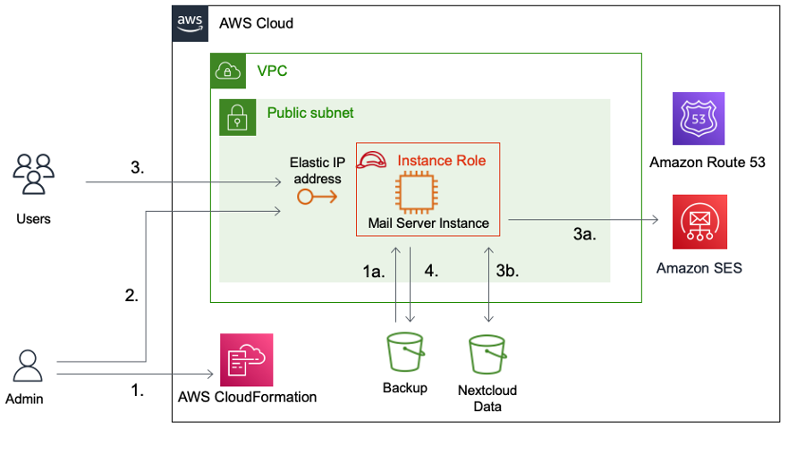
After preparing the AWS Account and environment, an administrator deploys the solution using an AWS CloudFormation template (1.). Optionally, a backup from Amazon S3 can be referenced during deployment to restore a previous installation of the solution (1a.). The admin can then proceed to setup via accessing the web UI (2.) to e.g., provision TLS certificates and create new users. After the admin has provisioned their accounts, users can access the web interface (3.) to send email, manage their inboxes, access calendar and contacts and share files. Optionally, outgoing emails are relayed via Amazon SES (3a.) and user data is stored in a dedicated Amazon S3 bucket (3b.). Furthermore, the solution is configured to automatically and periodically create incremental backups and store them into an S3 bucket for backups (4.).

On top of popular open source mail server packages such as [Postfix](https://www.postfix.org/) for SMTP and [Dovecot](https://www.dovecot.org/) for IMAP, Mail-in-a-box integrates [Nextcloud](https://nextcloud.com/) for calendar, contacts, and file sharing. However, note that Nextcloud capabilities in this context are limited. It’s primarily intended to be used alongside the core mail server functionalities to maintain calendar and contacts and for lightweight file sharing (e.g. for sharing files via links that are too large for email attachments). If you are looking for a fully featured, customizable and scalable Nextcloud deployment on AWS, have a look at this [AWS Sample](https://github.com/aws-samples/aws-serverless-nextcloud) instead.

## Deploying the solution
### Prerequisites
For this walkthrough, you should have the following prerequisites:
* An [AWS account](https://signin.aws.amazon.com/signin?redirect_uri=https%3A%2F%2Fportal.aws.amazon.com%2Fbilling%2Fsignup%2Fresume&client_id=signup)
* An existing external email address to test your new mail server. In the context of this sample, we will use `aws.opensource.mailserver@gmail.com` as the address.
* A domain that can be exclusively used by the mail server in the sample. In the context of this sample, we will use `aws-opensource-mailserver.org` as the domain. If you don’t have a domain available, you can register a new one with Amazon Route 53. In case you do so, you can go ahead and [delete](https://docs.aws.amazon.com/Route53/latest/DeveloperGuide/DeleteHostedZone.html) the associated hosted zone that gets automatically created via the [Amazon Route 53 Console](https://us-east-1.console.aws.amazon.com/route53/v2/hostedzones). We won’t need this hosted zone because the mail server we deploy will also act as [Domain Name System (DNS)](https://aws.amazon.com/route53/what-is-dns/) server for the domain.
* An SSH key pair for command line access to the instance. Command line access to the mail server is optional in this tutorial, but a key pair is still required for the setup. If you don’t already have a key pair, go ahead and create one in the EC2 Management Console: 
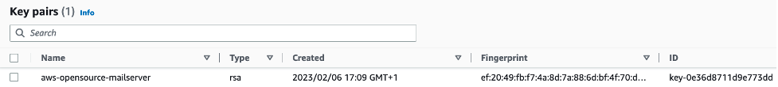
* (Optional) In this sample, we verify end-to-end functionality by sending an email to a single email address (`aws.opensource.mailserver@gmail.com`) leveraging Amazon SES in sandbox mode. In case you want to adopt this sample for your use case and send email beyond that, you need to [request removal of email sending limitations for EC2](https://aws.amazon.com/premiumsupport/knowledge-center/ec2-port-25-throttle/) or alternatively, if you relay your mail via Amazon SES request moving out of Amazon SES sandbox.

### Preliminary steps: Setting up DNS and creating S3 Buckets
Before deploying the solution, we need to set up DNS and create Amazon S3 buckets for backups and user data.
1. [Allocate an Elastic IP address](https://docs.aws.amazon.com/AWSEC2/latest/UserGuide/elastic-ip-addresses-eip.html#using-instance-addressing-eips-allocating): We use the address `52.6.x.y` in this sample.
1. Configure DNS: If you have your domain registered with Amazon Route 53, you can use the [AWS Management Console](https://us-east-1.console.aws.amazon.com/route53/home#DomainListing:) to [change the name server and glue records](https://docs.aws.amazon.com/Route53/latest/DeveloperGuide/domain-name-servers-glue-records.html#domain-name-servers-glue-records-adding-changing) for your domain. Configure two DNS servers `ns1.box.<your-domain>` and `ns2.box.<your-domain>` by placing your Elastic IP (allocated in step 1) into the Glue records field for each name server:
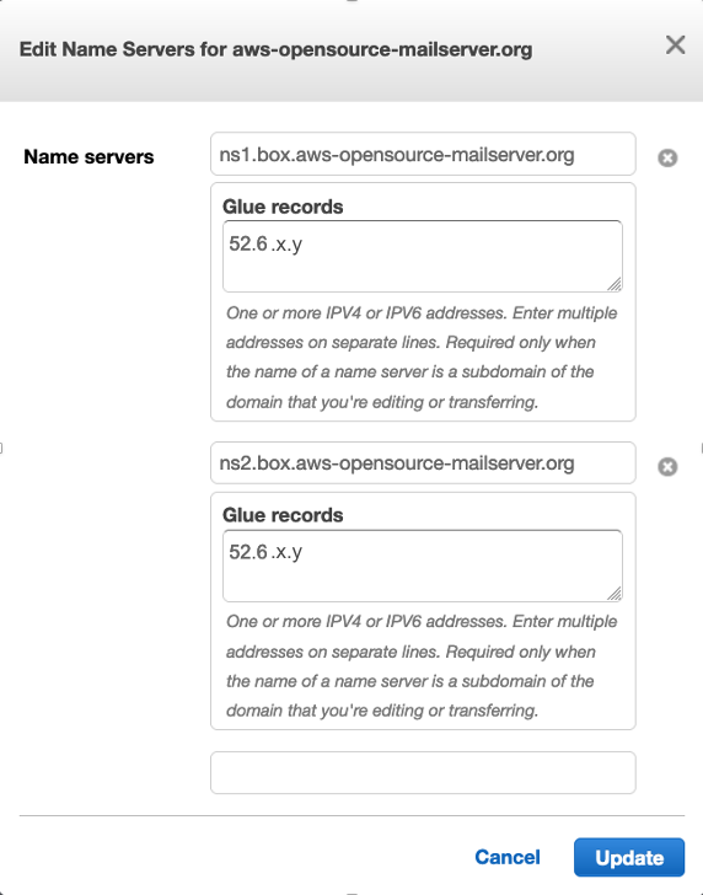
If you use a third-party DNS service, check their corresponding documentation on how to set the glue records.

    It may take a while until the updates to the glue records propagate through the global DNS system. Optionally, before proceeding with the deployment, you can verify your glue records are setup correctly with the dig command line utility:
    ```bash
    # Get a list of root servers for your top level domain
    dig +short org. NS
    # Query one of the root servers for an NS record of your domain
    dig c0.org.afilias-nst.info. aws-opensource-mailserver.org. NS
    ```
    This should give you output as follows:
    ```none
    ;; ADDITIONAL SECTION:
    ns1.box.aws-opensource-mailserver.org. 3600 IN A 52.6.x.y
    ns2.box.aws-opensource-mailserver.org. 3600 IN A 52.6.x.y
    ```
1. Create S3 buckets for backups and user data: Finally, in the Amazon S3 Console, [create a bucket](https://s3.console.aws.amazon.com/s3/bucket/create?region=us-east-1) to store Nextcloud data and another bucket for backups, choosing globally unique names for both of them. In context of this sample, we will be using the two buckets (`aws-opensource-mailserver-backup` and `aws-opensource-mailserver-nextcloud`) as shown here:
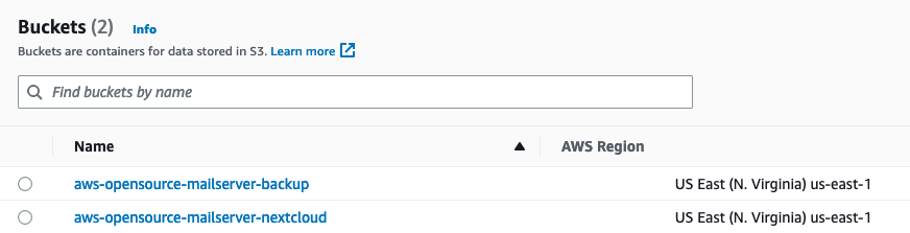

### Deploying and configuring Mail-in-a-Box
Click [](https://console.aws.amazon.com/cloudformation/home#stacks/new?stackName=aws-open-source-mail-server&templateURL=https://mmeidlin-public-blogs.s3.amazonaws.com/aws-mail-in-a-box/cloudformation/instance.yaml) to deploy and specify the parameters as shown in the below screenshot to match the resources created in the previous section, leave other parameters at their default value, then click **Next** and **Submit**.
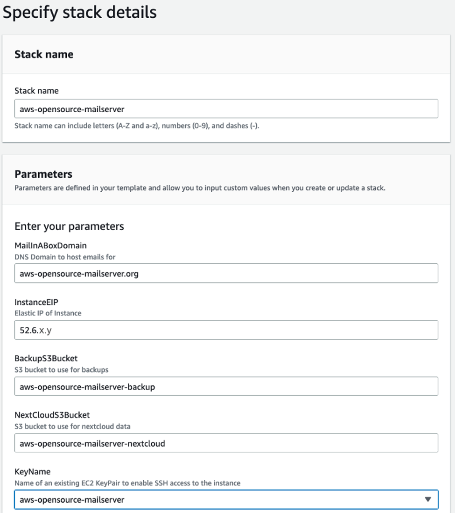
This will deploy your mail server into a public subnet of your default VPC which takes about 10 minutes. You can monitor the progress in the [AWS CloudFormation Console](https://us-east-1.console.aws.amazon.com/cloudformation/home?region=us-east-1#/stacks). Meanwhile, retrieve and note the admin password for the web UI from [AWS Systems Manager Parameter Store](https://us-east-1.console.aws.amazon.com/systems-manager/parameters/MailInABoxAdminPassword/) via the `MailInABoxAdminPassword` parameter.
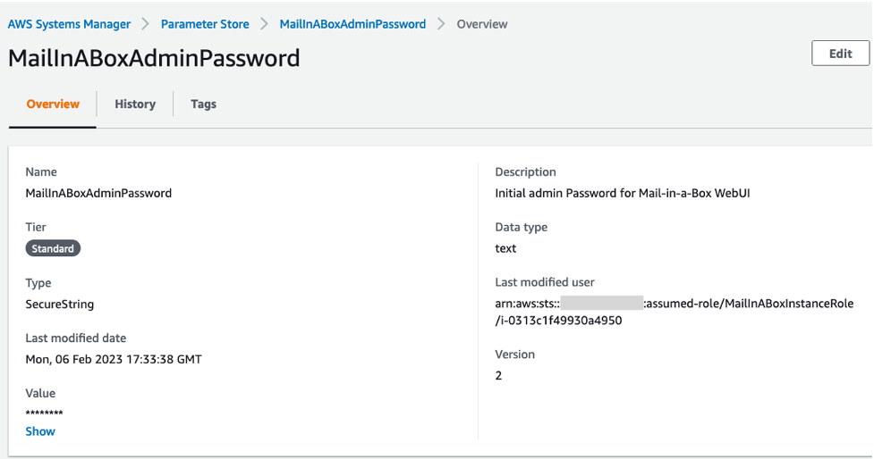
Roughly one minute after your mail server finishes deploying, you can log in at its admin web UI residing at https://52.6.x.y/admin with username `admin@<your-domain>`, as shown in the following picture (you need to confirm the certificate exception warning from your browser):
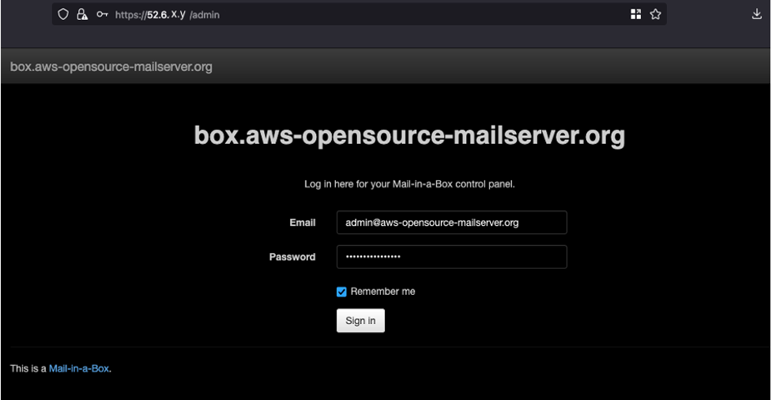
Finally, in the admin UI navigate to **System > TLS(SSL) Certificates** and click **Provision** to obtain a valid SSL certificate and complete the setup (you might need to click on **Provision** twice to have all domains included in your certificate, as shown here).
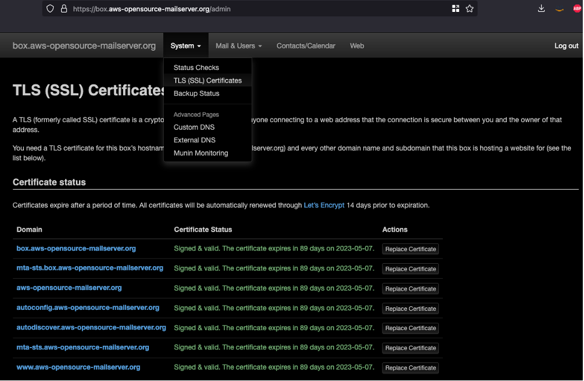

At this point, you could further customize your mail server setup (e.g., by creating inboxes for additional users). However, we will continue to use the admin user in this sample for testing the setup in the next section.

Note: If your AWS account is subject to email sending restrictions on EC2, you will see an error in your admin dashboard under **System > System Status Checks** that says ‘Incoming Email (SMTP/postfix) is running but not publicly accessible’. You are safe to ignore this and should be able to receive emails regardless.

## Testing the solution
### Receiving email
With your existing email account, compose and send an email to `admin@<your-domain>`. Then login as `admin@<your-domain>` to the webmail UI of your AWS mail server at `https://box.<your-domain>/mail` and verify you received the email:
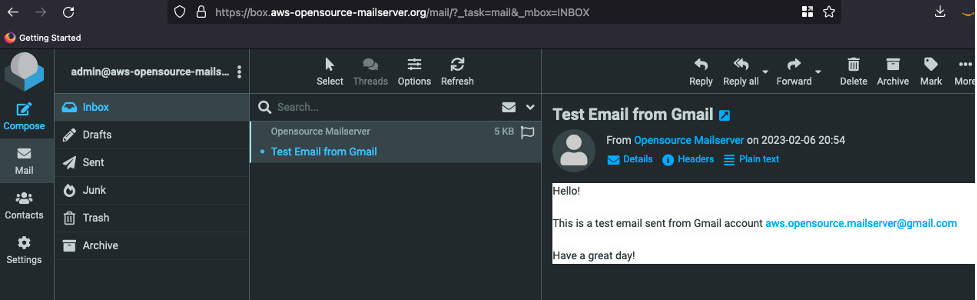

### Test file sharing, calendar and contacts with Nextcloud
Your Nextcloud installation can be accessed under `https://box.<your-domain>/cloud`, as shown in the next figure. Here you can manage your calendar, contacts, and shared files. Contacts created and managed here are also accessible in your webmail UI when you compose an email. Refer to the [Nextcloud documentation](https://docs.nextcloud.com/) for more details. In order to keep your Nextcloud installation consistent and automatically managed by Mail-in-a-box setup scripts, admin users are advised to refrain from changing and customizing the Nextcloud configuration.
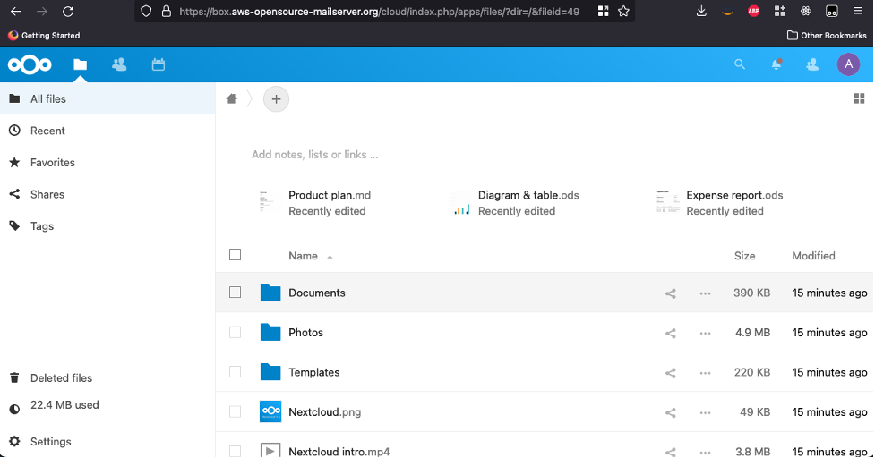

### Sending email
In order to use Amazon SES to accept and forward email for your domain, you first need to prove ownership of it. Navigate to **Verified Identities** in the [Amazon SES Console](https://us-east-1.console.aws.amazon.com/ses/home?region=us-east-1#/verified-identities) and click **Create identity**, select **domain** and enter your domain. You will then be presented with a screen as shown here:
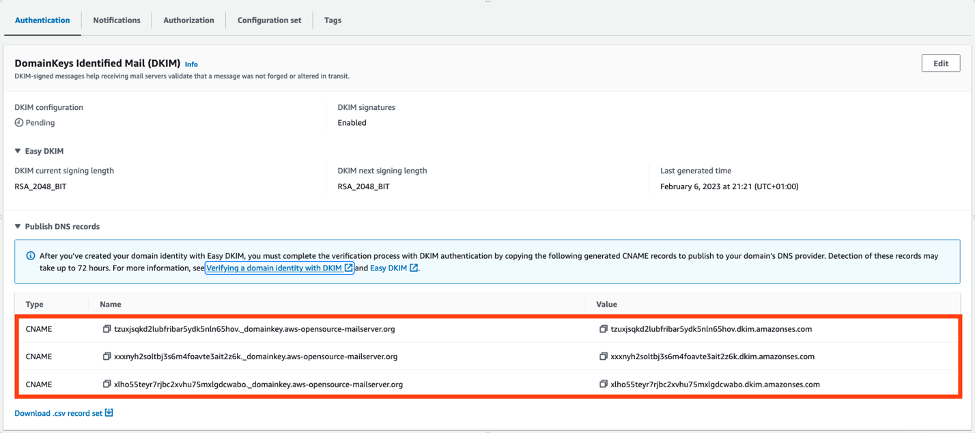
You now need to copy-paste the three CNAME DNS records from this screen over to your mail server admin dashboard. Open the admin web UI of your mail server again, select **System > Custom DNS**, and add the records as shown in the next screenshot.
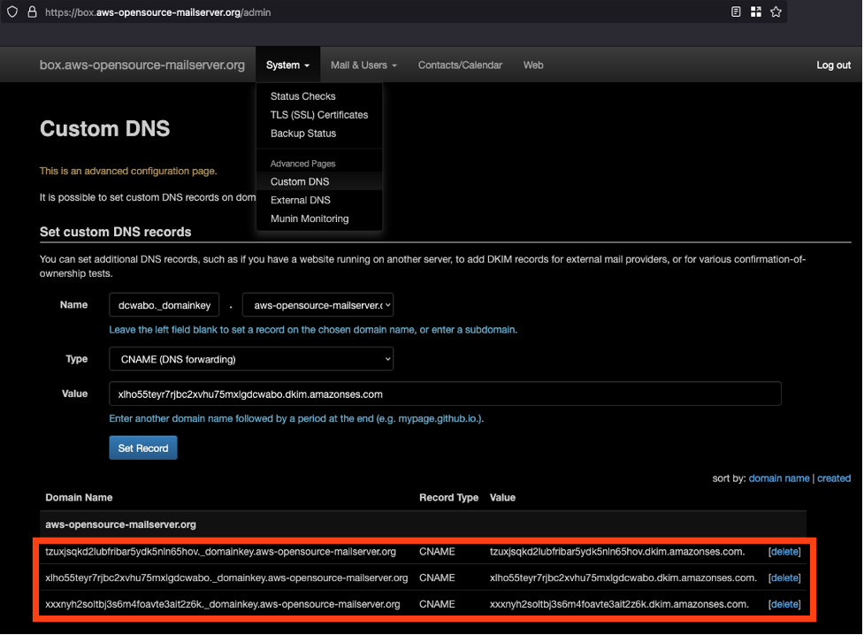
Amazon SES will detect these records, thereby recognizing you as the owner and verifying the domain for sending emails. Similarly, while still in [sandbox mode](https://docs.aws.amazon.com/ses/latest/dg/request-production-access.html), you also need to verify ownership of the recipient email address. Navigate again to **Verified Identities** in the [Amazon SES Console](https://us-east-1.console.aws.amazon.com/ses/home?region=us-east-1#/verified-identities), click **Create identity**, choose **Email Address**, and enter your existing email address.

Amazon SES will then send a verification link to this address, and once you’ve confirmed via the link that you own this address, you can send emails to it. Summing up, your verified identities section should look similar to the next screenshot before sending the test email:
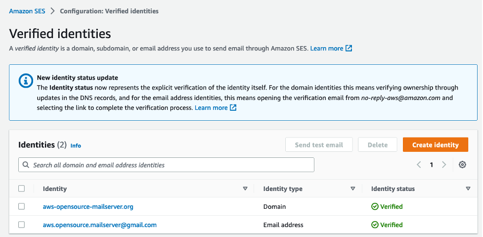
Finally, if you intend to send email to arbitrary addresses with Amazon SES beyond testing in the next step, refer to the documentation on [how to request production access](https://docs.aws.amazon.com/ses/latest/dg/request-production-access.html).

### Send test email
Now you are set to log back into your webmail UI and reply to the test mail you received before:
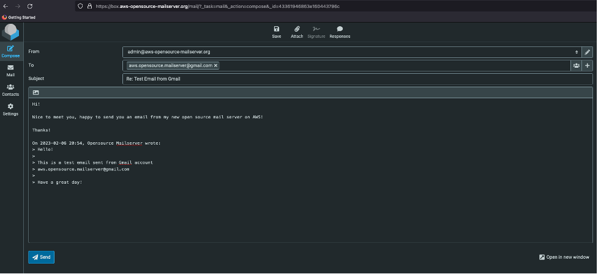
Checking the inbox of your existing mail, you should see the mail you just sent from your AWS server.
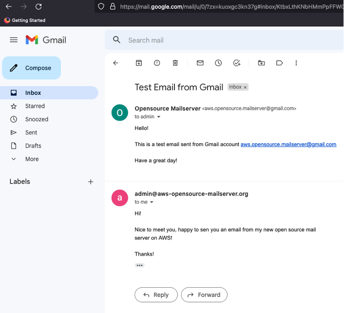
Congratulations! You have now verified full functionality of your open source mail server on AWS.

## Restoring from backup
Finally, as a last step, we demonstrate how to roll out immutable deployments and restore from a backup for simple recovery, migration and upgrades. In this context, we test recreating the entire mail server from a backup stored in Amazon S3.

For that, we use the restore feature of the CloudFormation template we deployed earlier to migrate from the initial `t2.micro` installation to an [AWS Graviton](https://aws.amazon.com/ec2/graviton/) arm64-based `t4g.micro` instance. This exemplifies the power of the immutable infrastructure approach made possible by the automated application level backups, allowing for simple migration between instance types with different CPU architectures.

### Verify you have a backup
By default, your server is configured to create an initial backup upon installation and nightly incremental backups. Using your ssh key pair, you can connect to your instance and trigger a manual backup to make sure the emails you just sent and received when testing will be included in the backup:

```bash
ssh -i aws-opensource-mailserver.pem ubuntu@52.6.x.y sudo /opt/mailinabox/management/backup.py
```
You can then go to your mail servers’ admin dashboard at `https://box.<your-doamin>/admin` and verify the backup status under **System > Backup Status**:
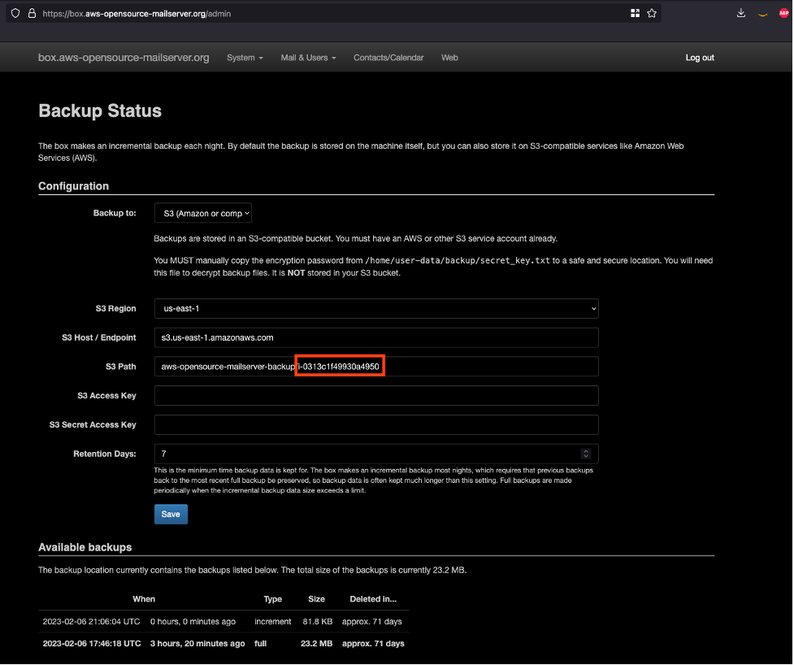
### Recreate your mail server and restore from backup
First, double check that you have saved the admin password, as you will no longer be able to retrieve it from Parameter Store once you delete the original installation of your mail server. Then go ahead and [delete](https://docs.aws.amazon.com/AWSCloudFormation/latest/UserGuide/cfn-console-delete-stack.html) the `aws-opensource-mailserver` stack from your CloudFormation Console an redeploy it by clicking on   [](https://console.aws.amazon.com/cloudformation/home#stacks/new?stackName=aws-open-source-mail-server&templateURL=https://mmeidlin-public-blogs.s3.amazonaws.com/aws-mail-in-a-box/cloudformation/instance.yaml). However, this time, change the parameters as shown below, changing the instance type and corresponding AMI as well as specifying the prefix in your backup S3 bucket to restore from.
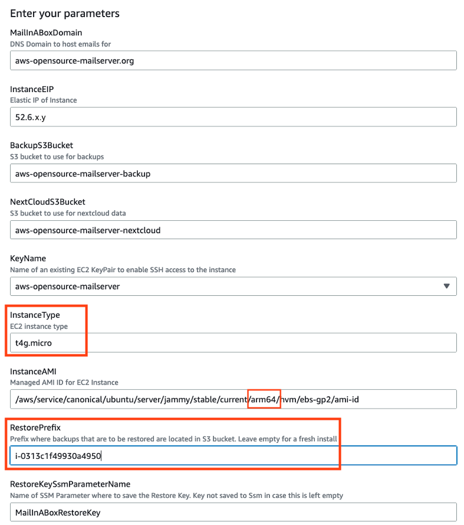
Within a couple of minutes, your mail server will be up and running again, featuring the exact same state it was before you deleted it, however, running on a completely new instance powered by AWS Graviton. You can verify this by going to your webmail UI at `https://box.<yourdomain>/mail` and logging in with your old admin credentials.

## Cleaning up
- [Delete](https://docs.aws.amazon.com/AWSCloudFormation/latest/UserGuide/cfn-console-delete-stack.html) the mail server stack from [CloudFormation Console](https://us-east-1.console.aws.amazon.com/cloudformation/home?region=us-east-1#/stacks)
- [Empty](https://docs.aws.amazon.com/AmazonS3/latest/userguide/empty-bucket.html) and [delete](https://docs.aws.amazon.com/AmazonS3/latest/userguide/delete-bucket.html) both the backup and Nextcloud data S3 Buckets
- [Release](https://docs.aws.amazon.com/AWSEC2/latest/UserGuide/elastic-ip-addresses-eip.html#using-instance-addressing-eips-releasing) the Elastic IP
- In case you registered your domain from Amazon Route 53 and do not want to hold onto it, you need to [disable automatic renewal](https://docs.aws.amazon.com/Route53/latest/DeveloperGuide/domain-enable-disable-auto-renewal.html). Further, if you haven’t already, [delete the hosted zone](https://docs.aws.amazon.com/Route53/latest/DeveloperGuide/DeleteHostedZone.html) that got created automatically when registering it.

## Outlook
The solution discussed so far focuses on minimal operational complexity and cost and hence is based on a single Amazon EC2 instance comprising all functions of an open source mail server, including a management UI, user database, Nextcloud and DNS. With a suitably sized instance, this setup can meet the demands of small to medium organizations. In particular, the continuous incremental backups to Amazon S3 provide high resiliency and can be leveraged in conjunction with the CloudFormation automations to quickly recover in case of instance or single Availablity Zone (AZ) failures.

Depending on your requirements, extending the solution and distributing components across AZs allows for meeting more stringent requirements regarding high availability and scalability in the context of larger deployments. Being based on open source software, there is a straight forward migration path towards these more complex distributed architectures once you outgrow the setup discussed in this post.

## Conclusion
In this sample, we showed how to automate the deployment of an open source mail server on AWS and how to quickly and effortlessly restore from a backup for rolling out immutable updates and providing high resiliency. Using AWS CloudFormation infrastructure automations and integrations with managed services such as Amazon S3 and Amazon SES, the lifecycle management and operation of open source mail servers on AWS can be simplified significantly. Once deployed, the solution provides an end-user experience similar to popular SaaS and commercial offerings.

You can go ahead and use the automations provided in this sample to get started with running your own open source mail server on AWS!

# Related Projects

- [**lightsail-miab-installer**](https://github.com/rioastamal/lightsail-miab-installer): A user-friendly command-line tool designed to streamline the setup of Mail-in-a-Box on Amazon Lightsail.

# Security

See [CONTRIBUTING](CONTRIBUTING.md#security-issue-notifications) for more information.

# License

This library is licensed under the MIT-0 License. See the LICENSE file.

